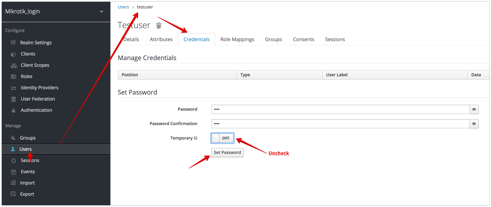
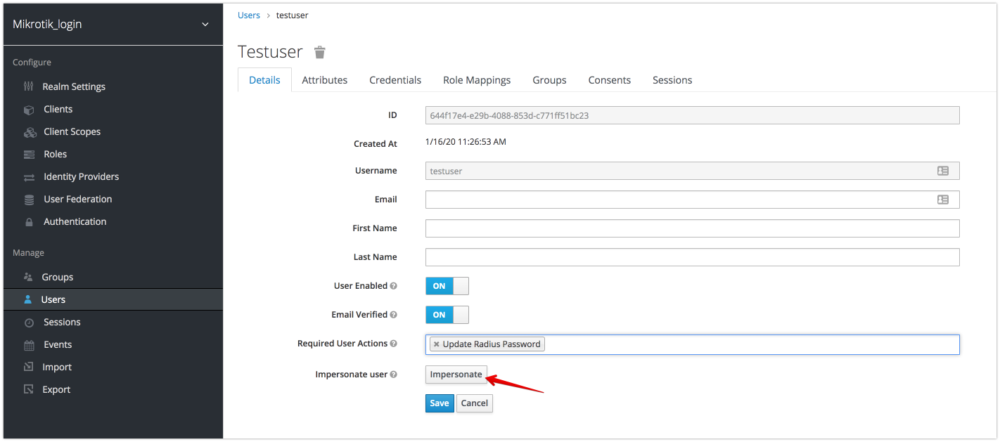
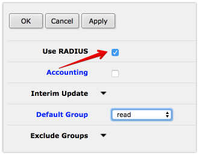
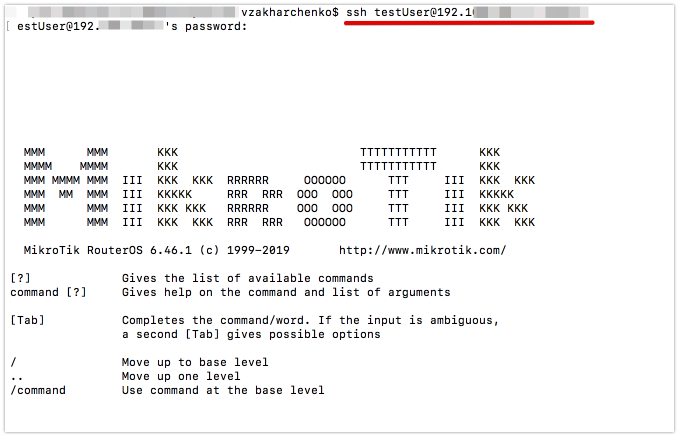
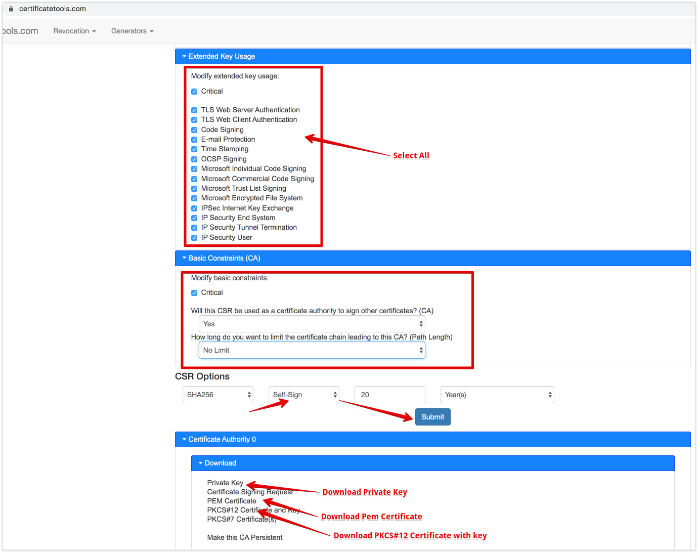
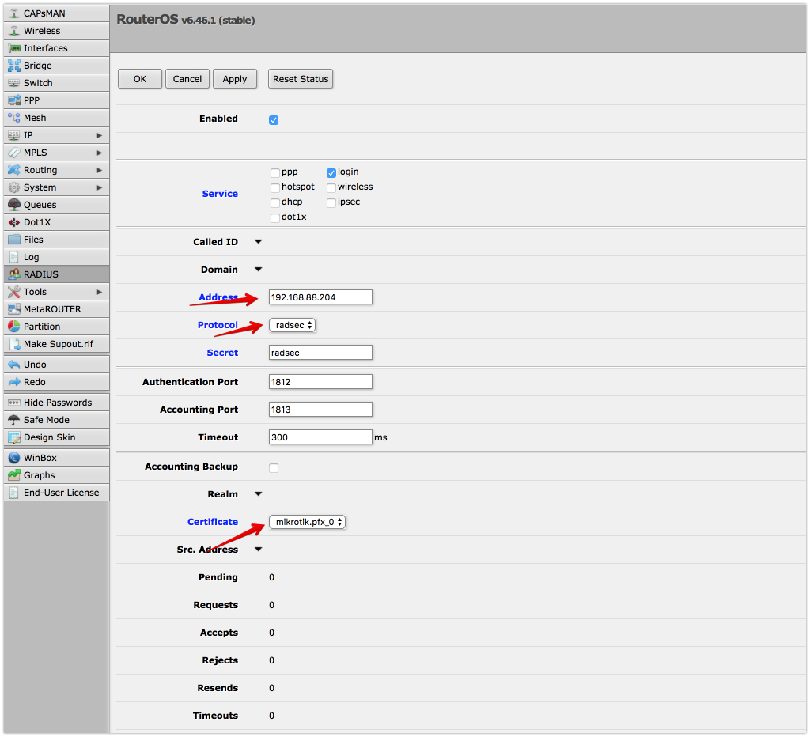

# keycloak-radius-plugin

  
  
  
  

features:
- radius server
- radius rad-sec server(Radius over TLS)
- hotspot:
  - pop,chap authorization
  - openID connect
  - login using facebook, google, etc...
- login
  - support api, winbox, web(Mikrotik)
## setup
### build project
***requirements***: java jdk 11 and above, maven 3.5 and above
 - <pre><code>cd keycloak-plugins</pre></code>
 - <pre><code>mvn clean install</pre></code>
### Configure keycloak
***requirements***: [keycloak 8.0.1](https://downloads.jboss.org/keycloak/8.0.1/keycloak-8.0.1.zip) (I think it should work on earlier versions)
- setup radius-plugin <pre><code>${KEYCLOAK_PATH}/bin/jboss-cli.sh --command=module add --name=keycloak.plugins.radius --resources=${SOURCE}/keycloak-plugins/radius-plugin/target/radius-plugin-1.0-SNAPSHOT.jar --dependencies=org.jboss.logging,org.keycloak.keycloak-core,org.keycloak.keycloak-services,org.keycloak.keycloak-server-spi,org.keycloak.keycloak-server-spi-private,org.apache.commons.io,javax.activation.api,javax.servlet.api,org.jboss.resteasy.resteasy-jaxrs,javax.ws.rs.api,com.fasterxml.jackson.core.jackson-databind,org.keycloak.keycloak-common,com.fasterxml.jackson.core.jackson-core,javax.transaction.api,org.hibernate,io.netty,org.slf4j,javax.xml.bind.api,org.apache.commons.codec</pre></code>
- setup rad-sec plugin <pre><code>${KEYCLOAK_PATH}/bin/jboss-cli.sh --command=module add --name=keycloak.plugins.rad.sec --resources=${SOURCE}/keycloak-plugins/rad-sec-plugin/target/rad-sec-plugin-1.0-SNAPSHOT.jar --dependencies=org.jboss.logging,org.keycloak.keycloak-core,org.keycloak.keycloak-services,org.keycloak.keycloak-server-spi,org.keycloak.keycloak-server-spi-private,org.apache.commons.io,javax.activation.api,com.fasterxml.jackson.core.jackson-databind,org.keycloak.keycloak-common,com.fasterxml.jackson.core.jackson-core,javax.transaction.api,org.hibernate,io.netty,org.slf4j,javax.xml.bind.api,org.apache.commons.codec,keycloak.plugins.radius</pre></code>
- setup mikrotik plugin <pre><code>${KEYCLOAK_PATH}/bin/jboss-cli.sh --command=module add --name=keycloak.plugins.radius.mikrotik --resources=${SOURCE}/keycloak-plugins/mikrotik-radius-plugin/target/mikrotik-radius-plugin-1.0-SNAPSHOT.jar --dependencies=org.jboss.logging,org.keycloak.keycloak-core,org.keycloak.keycloak-services,org.keycloak.keycloak-server-spi,org.keycloak.keycloak-server-spi-private,org.apache.commons.io,javax.activation.api,com.fasterxml.jackson.core.jackson-databind,org.keycloak.keycloak-common,com.fasterxml.jackson.core.jackson-core,javax.transaction.api,org.hibernate,io.netty,org.slf4j,javax.xml.bind.api,org.apache.commons.codec,keycloak.plugins.radius</pre></code>
- run script for standalone <pre><code>${KEYCLOAK_PATH}/bin/jboss-cli.sh --file=${SOURCE}/cli/radius.cli</pre></code>
- run script for standalone-ha <pre><code>${KEYCLOAK_PATH}/bin/jboss-cli.sh --file=${SOURCE}/cli/radius-ha.cli</pre></code>
where
- **KEYCLOAK_PATH** - Path where you are unpacked keycloak-8.0.1.zip
- **SOURCE** - Path where you checked out the code and built the project
## Configuration
### Radius server config file
-  create file ${KEYCLOAK_PATH}config/radius.config
-  example <pre><code>{
  {
   "sharedSecret":"radsec",
   "authPort":1812,
   "accountPort":1813,
   "useUdpRadius":false,
   "radsec":{
      "privateKey":"config/private.key",
      "certificate":"config/public.crt",
      "useRadSec":true
   }
}</code></pre>
where
   -  **sharedSecret** - Used to secure communication between a RADIUS server and a RADIUS client.
   -  **authPort** - Authentication and authorization port
   -  **accountPort** - Accounting port
   -  **useUdpRadius** - if true, then listen to authPort and accountPort
   -  **radsec** - radsec configuration
   -  **privateKey** - private SSL key (https://netty.io/wiki/sslcontextbuilder-and-private-key.html)
   -  **certificate** - certificates chain
   -  **useRadSec** - if true, then listen  radsec port
## Run Keycloak Locally
<pre><code>
#!/usr/bin/env bash
set -e
cd target/keycloak/keycloak-8.0.1
public_ip=`ifconfig | grep -Eo 'inet (addr:)?([0-9]*\.){3}[0-9]*' | grep -Eo '([0-9]*\.){3}[0-9]*' | grep -v '127.0.0.1' -m 1`
sh bin/standalone.sh  -c standalone-ha.xml -b 0.0.0.0 -Djboss.bind.address.management=0.0.0.0 -Djboss.bind.address.private=${public_ip} -Djboss.node.name=${public_ip} -Djgroups.bind.address=${public_ip} --debug 8190 -Djboss.http.port=8090
</pre></code>

### Keycloak Client with Radius Protocol

### Assign Radius Attributes to Role
> **_NOTE:_**  Composite roles supported

### Assign Radius Attributes to Group
> **_NOTE:_**  SubGroups supported

### Assign Radius Attributes to User

### Mikrotik Login Example (Radius Server)
1. create ${KEYCLOAK_PATH}/config/radius.config
<pre><code>{
  {
   "sharedSecret":"TEST",
   "authPort":1812,
   "accountPort":1813,
   "useUdpRadius":true,
   "radsec":{
      "privateKey":"config/private.key",
      "certificate":"config/public.crt",
      "useRadSec":false
   }
}</code></pre>

2.  create "mikrotik_login" Realm
3. create "radius" client 
4. create role "MIKROTIK-ADMIN" 
5. assign radius attribute "Mikrotik-Group"="full" to Role "MIKROTIK-ADMIN" 
6. create "testUser" User 
7. set Password "test" for User. uncheck "Temporary"  
8. assign Role "MIKROTIK-ADMIN" to "testUser" 
9. set Action "Update Radius Password" (or send this event to user be email) 
10. Impersonate user 
11. Sign-out 
12. Login with testUser:test 
13. Set Radius User Password 
14. open Mikrotik Radius configuration Page 
15. enable Radius AAA  
16. try to login with a new User  
17. try to login by ssh(the same for telnet and winbox) 

### Mikrotik Rad-sec Example
1. generate keys and certificates (**I don't have experience with openssl, so I am using [https://certificatetools.com/](https://certificatetools.com/)** )
2. Page 1 
3. Page 2 
4. download private key to ${KEYCLOAK_PATH}/config/private.key
5. download PEM Certificate to ${KEYCLOAK_PATH}/config/public.crt
6. enable radSec( [sharedSecret have to be "radsec"](https://wiki.mikrotik.com/wiki/Manual:RADIUS_Client) ) :
<pre><code>{
  {
   "sharedSecret":"redsec",
   "authPort":1812,
   "accountPort":1813,
   "useUdpRadius":true,
   "radsec":{
      "privateKey":"config/private.key",
      "certificate":"config/public.crt",
      "useRadSec":true
   }
}</code></pre>

7. download PKCS#12 Certificate
8. upload PKCS#12 Certificate  to Mikrotik 
9. import Certificate 
10. enable radsec 

### Mikrotik Hotspot Example (with Facebook login)

in progress...
